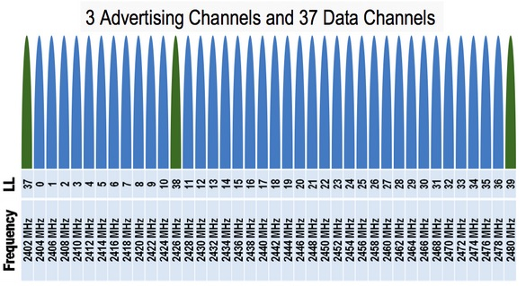
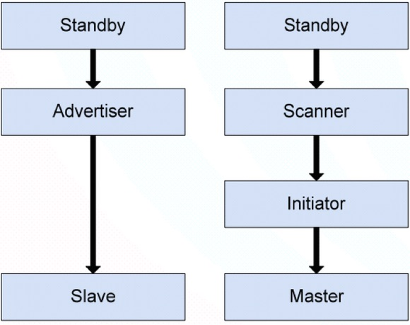
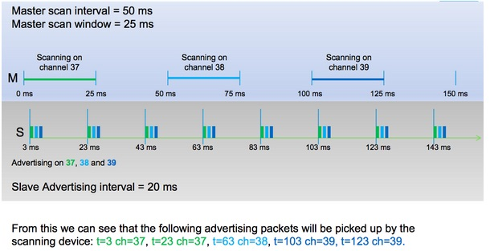
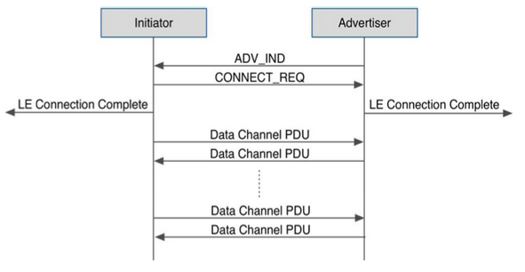
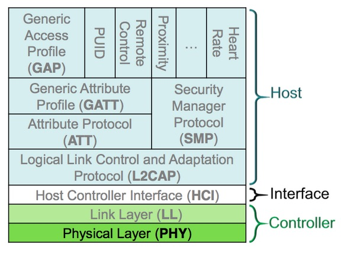
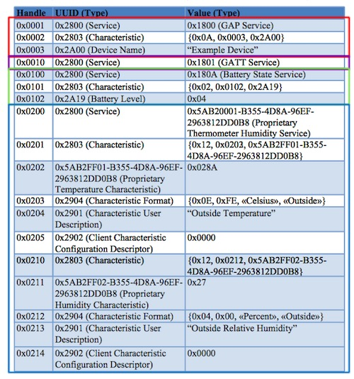

##BLE物理层
###RF规格特性
-  运行在2.4GHz ISM频段
-  GFSK 调制方式(高斯频移键控) 
-  Bit-rate：1Mbit/s  

###广播通道  
-  40个频道，2MHz的频道间隙
-  3 个固定的广播通道
-  37 个自适应自动跳频数据通道  

  

###星形拓扑结构
-  主设备管理着连接,并且可以连接多个从设备 
-  一个从设备只能连接一个主设备
  
***
##BLE设备状态
###有六种可能的状态
-  待机状态(Standby)：设备没有传输和发送数据，没有连接到任何设备
-  广播状态(Advertiser)：周期性广播状态
-  扫描状态(Scanner)：主动地寻找正在广播的设备
-  发起连接状态(Initiator)：主动向某个设备发起连接
-  主设备(Master)：已建立连接的设备，主动发起连接的一方
-  从设备(Slave) ：已建立连接的设备，被动接受连接的一方

  

###BLE广播状态
-  广播包的发送是单向的，不需要任何连接
-  广播包可以包含特定的数据定义，最大31个字节
-  广播包可以直接指向某个特定的设备，也可以不指定
-  广播中可以声明是可被连接的设备，或者是不可连接的设备
-  在一个广播事件中，广播包会分别在三个广播通道中送一次(分别是37，38，39通道)
-  广播间隔: 两次广播事件之间的最小时间间隔
-  广播间隔的取值范围是在20ms ~ 10.24s之间
-  链路层会在每次广播事件期间产生一个随机延时时间，来避免多设备之间的数据碰撞。
  

###BLE扫描状态
-  每次扫描设备打开Radio接收器去监听广播包
-  扫描事件交替发生在三个特定的广播通道（37, 38, 39通道） 
-  扫描间隔: 即扫描设备的扫描频度
-  扫描窗口: 每次扫描事件持续的时间

  
  

###BLE发起连接状态
-  除了扫描，设备也可以主动发起连接
-  当它监听到一个可连接的广播，发起设备会发送一个连接请求
-  连接请求包括一套为从设备准备的连接参数，安排连接事件发生的的通道和时间
-  如果广播设备接收了连接，两个设备会进入连接状态，发起方会称为主设备(Master)，广播方会称为从设备(Slave)
-  BLE连接参数: 
	-  通道映射：指示连接使用的频道
	-  跳频增量：参与通道的选择算法  
	-  连接间隔：即Connection Interval，1.25ms的倍数，7.5ms-4.0s之间
	-  监督超时：即Slave latency，监督连接无响应的超时时间
	-  从机潜伏：即Supervision timeout，从设备响应的潜伏时间

  

###BLE连接状态
-  所有的通讯都发生在两个设备的连接事件期间
-  连接事件周期地发生，按照连接参数指定的间隔
-  每个事件发生在某个数据通道(0-36)，跳频增量参数决定了下次连接事件发生的通道
-  在每个连接事件期间，Master先发送，Slave会在150us之后做出回应
-  从设备潜伏:
	-  Slave如果没有数据发送, 允许跳过连接事件
	-  连接参数中的Slave 的潜伏值,是允许从设备跳过的最大连接次数
	-  在连接事件中，如果slave没有对master的包做出回应，master会在后来的连接事件中重复发送，直到slave回应

####传输数据
  

####超时断开
  

####速度计算
  

###BLE终止连接
-  Master和Slave都可以主动断开连接
-  一边发起断开，另一边必须在在断开连接之前回应这个断开请求
-  监视超时而断开连接
	-  监视超时参数指定了两个数据包之间的最大时间跨度
	-  slave和master双方都维持着自己的监视超时计时器，在每次收到数据包时清零。
	-  如果连接超时，设备会认为连接丢失，并且退出连接状态，返回广播、扫描或者待机模式。

***
##BLE协议栈
###协议栈分层
-  由Controller和Host组成；
	-  单芯片方案（SoC方案）：Controller、Host、Profile、Application在同一芯片中；
	-  双芯片方案：Controller属于一个芯片，Host、Profile、Application属于另一个芯片（或系统）；
-  HCI：Host Controller Interface
-  LL：Link Layer
-  L2CAP：Logical Link Control and Adaptation Protocol
-  ATT：Attribute Protocol
-  GATT：Generic Attribute Profile 
-  GAP：Generic Access Profile
-  SMP：Security Manager Protocol
  
  

###BLE Link Layer(LL)
-  分组数据单元（PDU：packet data unit）
  

###BLE L2CAP
-  为上层协议提供connection-oriented和connection-less的支持
-  协议复用（经典蓝牙和低功耗蓝牙共存的情况下）
-  数据的分包与组包
-  流控与重传

###BLE ATT
-  ATT：Attribute Protocol
-  Attribute就是data
	-  Handle：属性在列表中的地址
	-  Type：说明代表什么数据，由Bluetooth SIG预定义或者是客户自己定义的UUID (universal unique identifier)
-  Permissions：权限声明
-  Client／Server架构
	-  服务端提供数据，比如：contains attributes, receives requests, executes, responds, can indicate values
	-  客户端使用数据，比如：sends requests, commands, waits for responses, can confirm indications
	-  设备的服务/客户角色，不依赖于GAP层中心设备/外围设备角色，和LL层的Master/Slave角色定义，类似Socket
  
  

###BLE GATT
-  GATT：Generic Attribute Profile 
	-  Profile通常是由一个或多个Services组成
	-  一个Service包含一个或多个Characteristic values
	-  Characteristic可以用descriptor来描述它的特性
-  客户端和服务端的通讯方式
	-  Discover Characteristic by UUID：搜索服务端设备所能提供的所有匹配UUID
	-  Read Characteristic Value：使用指定的handle读Characteristic
	-  Write Characteristic Value：使用指定的handle写Characteristic
	-  Notification：服务端主动向客户端报告Characteristic的变化
	-  Indication：客户端应用层需ACK

###BLE GAP
-  GAP：Generic Access Profile
-  Basic requirements of a device
-  Description of behaviours and methods for device discovery, connection establishment, security, authentication, association   models, service discovery
-  LE device roles: Peripheral, Central, etc.

###BLE SMP
-  SMP：Security Manager Protocol
-  Just Works: Gives an unauthenticated link
-  Man In The Middle protection: User enter passkey
-  Out-of-Band: Uses some other way to give a key

***
##更多资料
[JUMA低功耗蓝牙培训PPT](./juma_ble_tutor.pdf)

