本文介绍 JUMA 的 iOS SDK 的环境搭建及其使用。

iOS SDK 配合嵌入式 SDK 共同实现设备-手机的蓝牙通信功能。相对于 iOS 原生的 BLE SDK，它使用起来更为简单，开发者不再需要了解 BLE 特有的如 service、characteristic、notification 等概念。此外，该 SDK 还增加了设备端固件空中升级(OTA)的功能。


以下所有操作请在 Xcode 6 或 Xcode 7 中完成. 如果没有 Xcode 的使用经验, 请严格按照下面所说的进行操作, 并在需要输入的地方输入相同的内容.  


## iOS 环境搭建
###一、新建一个 Xcode 工程
####1.打开 Xcode  
启动 Xcode 之后会出现如下的 Welcome 窗口 (窗口的右侧用来列出曾经打开过的工程). 如果没有出现窗口, 请点击 dock 栏上的 Xcode 图标.  
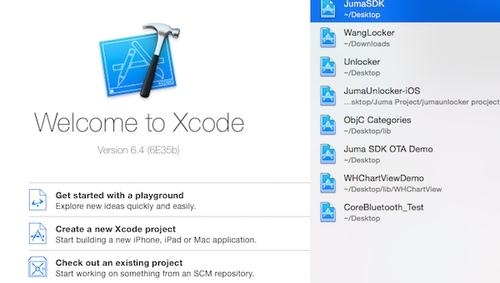  

####2.开始创建工程  
Welcome 窗口的左下角列出了 3 个可供选择的选项, 点击第 2 个 "Create a new Xcode project", 会出现如下的助手窗口.   
  
在助手窗口中, 按照红色箭头的指向, 依次点击红色方框中的内容, 以便创建一个只有单个空白页面的新工程.  

如果没有出现 Welcome 窗口, 按下图操作也可出现助手窗口  
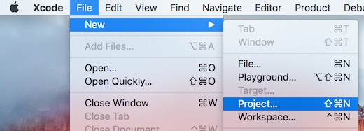  
  
####3.完善 app 的信息  
完成第 2 步之后, 会出现一个如下的新窗口, 在这个窗口中, 为这个新的工程完善信息.  
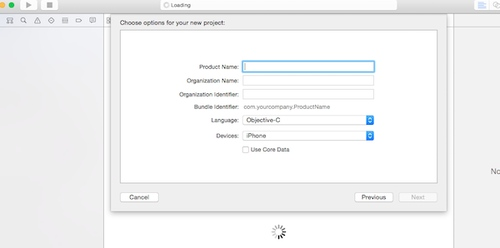  
从上往下  
第 1 项: Product Name, 即产品名称, 也可以理解为 app 的名字.  
第 2 项: Organization Name, 即组织名称, 也就是公司名称或者团队名称.  
第 3 项: Organization Identifier, 即组织标识符, 一般格式为: com.公司名.  
第 4 项: Bundle Identifier, 即包标识符, 由第 3 项和第 1 项共同组成.  
第 5 项: Language, 即用来编写这个 app 的编程语言, 可选值有 Objective-C 和 swift, 在本使用说明使用 Objective-C.  
第 6 项: Devices, 即目标设备的种类, 也就是你的 app 准备运行在哪个种类的 iOS 设备上, 可选值有 iPhone, iPad, Universal(通用), 在本使用说明使用 iPhone.  
第 7 项: Use Core Data, 即是否在项目中创建 CoreData 数据库文件以便存储数据. 如果不清楚是否要创建 CoreData 文件, 请不要选中此项.  

app 信息示例: (在完善了所有信息之后, 请请点击如下图所示的红色方框中的按钮)  
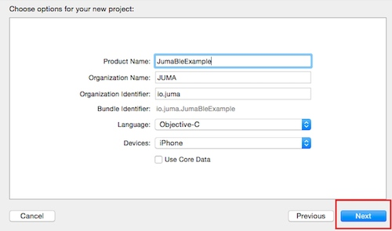  

####4.选择工程文件的存放位置  
完成第 3 步后, 会弹出如下窗口以便选择工程文件的存放位置. 选好位置以后, 请点击图中红色方框中的按钮.  
注: 如果不明白红色圆形包围的选项的含义和作用, 请不要选中它.  
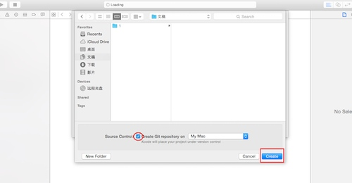  


###二、修改这个工程的配置
####1.app 的基本配置
在创建一个 Xcode 工程之后, 会出现如下所示的窗口. 在这个窗口中, 可以修改 app 的一些配置. 红色方框中的是 2 个常用配置:  
第 1 个: Deployment Target, 是这个 app 可以兼容的, 最低的 iOS 版本. 点击右侧向下的箭头, Xcode 会列出所有可供选择的 iOS 版本号. (Juma iOS SDK 支持的最低的 iOS 版本是 iOS 7.0)  
第 2 个: Devices, 是这个 app 可以运行的 iOS 设备的种类, 点击右侧向下的箭头, Xcode 会列出可选值.    
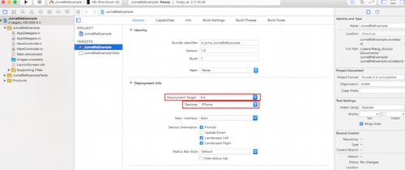  

####2.为工程添加 CoreBluetooth 框架.  
为了在工程中使用 Juma iOS SDK, 需要为这个工程添加 CoreBluetooth 框架. 请参照红色箭头的顺序, 依次点击红色方框中的内容.  
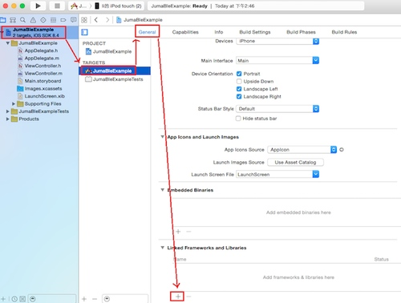  
随后, 会出现如下的窗口  
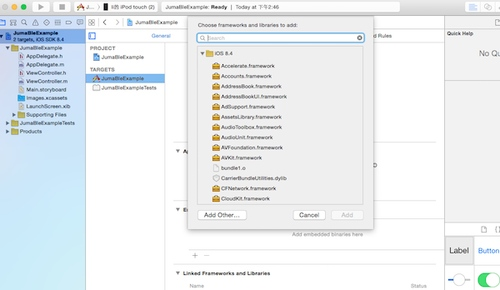  
在搜索框中输入 ```CoreBluetooth```, 按照红色箭头的顺序, 依次点击红色方框中的内容.  
  
出现下图的两个红色方框中的内容时, 说明框架添加完成.   
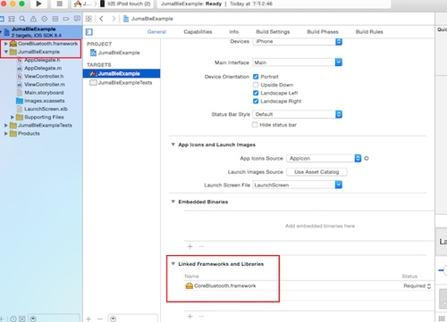  

####3.为工程添加链接参数   
为了在工程中使用 Juma iOS SDK, 需要先为这个工程添加一个链接参数. 请参照红色箭头的顺序, 依次点击红色方框中的内容, 在最后一个红色方框内的搜索框中输入 ```Other Linker Flags```.  
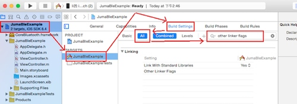  
在下图的长方形红色方框的末尾双击, 会出现一个编辑窗口, 用来添加/删除参数. 编辑窗口出现后, 点击正方形红色方框中的 + 号.    
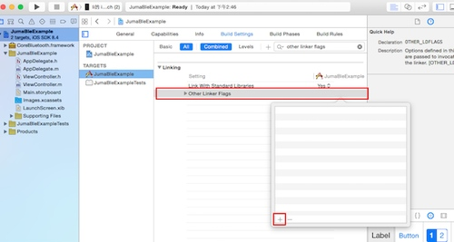  
点击 + 号以后, 会出现下图红色方框所示的输入框, 在输入框中输入 ```-ObjC```.  
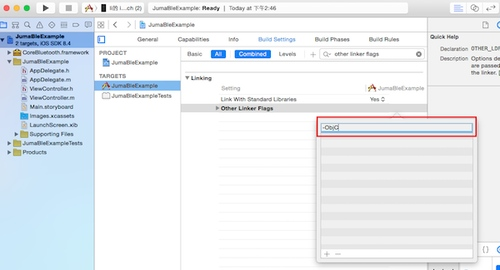  
输入完成后, 点击编辑窗口以外的空白区域, 出现下图红色方框中的内容时, 就说明参数添加成功.  
  

####4.让 app 能够在后台运行  
iOS 系统提供了几种允许 app 在后台运行的模式, 蓝牙形式的后台模式就是其中之一. 为了让 app 能够在后台完成蓝牙任务, 请参照下图红色箭头的顺序点击并完成红色方框中的内容.  
  


###三、向工程添加 Juma iOS SDK 的代码文件
找到以黄色的文件夹图标开头, 并和工程同名的那一行, 如下图所示  
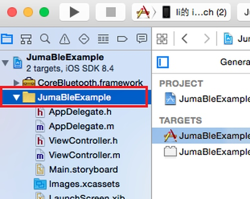  
在这一行上右键, 点击右键菜单中的 Add Files to 选项  
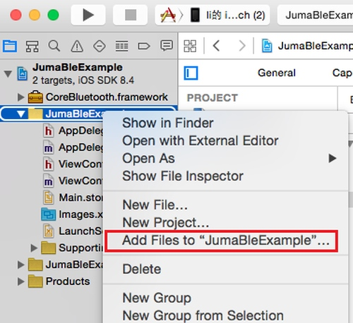  
随后会出现一个如下的窗口用来查找 Juma iOS SDK 的文件的位置, 找到文件后, 从上到下, 依次完成红色方框中的内容.  
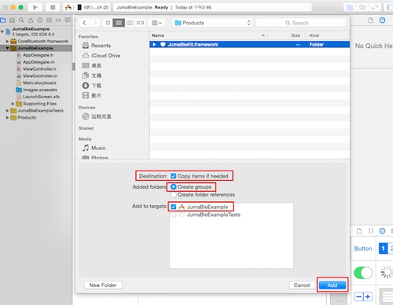  
完成上一步以后, 出现类似如下图所示内容, 就表示 Juma iOS SDK 代码文件添加成功.    
注: Juma iOS SDK 项目的最终产品的名称已经更改为 JumaBluetoothSDK.framework.   
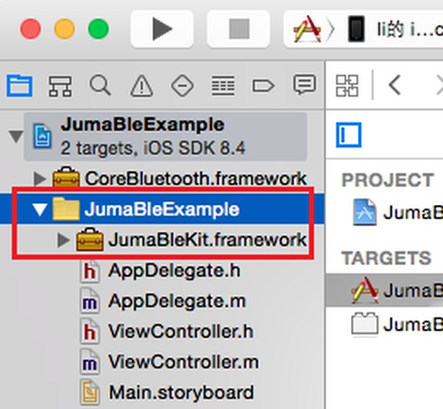  


至此, 创建工程, 修改工程的配置, 添加 Juma iOS SDK 文件就全部完成了.  


***
## 开源代码和例程

Juma iOS SDK 现在已经全部开源，您可以从以下地址获取： 

* SDK 代码仓库：[https://github.com/JUMA-IO/BLE_SDK_iOS](https://github.com/JUMA-IO/BLE_SDK_iOS)

此外，我们还提供了一些使用 SDK 的例程，包括：

* BLE 调试助手：[https://github.com/JUMA-IO/BLE_Debugger_iOS](https://github.com/JUMA-IO/BLE_Debugger_iOS)


