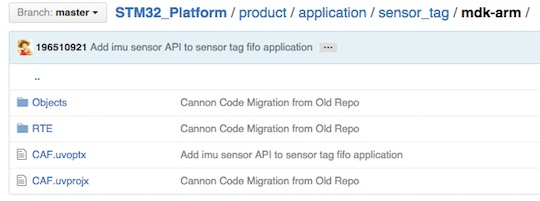
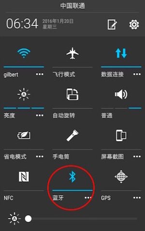
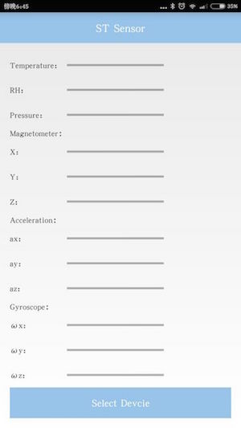
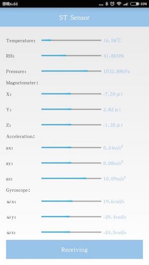

##概述
Cannon上板载了多个由意法半导体(ST)出品的传感器，包括加速度计/陀螺仪、磁力计、气压计、温湿度计。本例程讲述了如何通过SDK的JSensor API(传感器API接口)获取这些传感器的数据，以及如何通过BLE API(低功耗蓝牙API接口)将这些数据接收到手机。

***
##获取嵌入式SDK及例程
下载最新的嵌入式SDK(发布版)：  
[https://github.com/JUMA-IO/STM32_Platform/releases](https://github.com/JUMA-IO/STM32_Platform/releases)  
如JUMA STM32 Platform SDK v1.0.0：   


> 如果您想获知最新的代码改动情况，请使用github的“watch”功能。


***
##编译和烧录嵌入式软件
####Step1. 打开样本工程：
```
x:/Cannon/product/application/sensor_tag/mdk-arm/CAF.uvproj
```


####Step2. 编译工程


####Step3. 烧入软件


***
##手机安装ST_SENSOR APP
有两种方式可以安装“ST_SENSOR”APP：  
第一种方式：使用Android的APK文件，该文件位于SDK的tools目录下： 
  
```
x:/Cannon/tools/STSensor.apk
```

将该文件传送到Android手机，直接安装便可。

第二种方式：如果您熟悉Android开发环境，可以使用“ST_SENSOR APP”的源码来安装。“ST_SENSOR”APP的源码位于：  
[https://github.com/JUMA-IO/BLE_SensorTag_Android](https://github.com/JUMA-IO/BLE_SensorTag_Android)

***
##和手机APP通信
####Step1. 打开手机的蓝牙功能


####Step2. 运行“ST_SENSOR”APP  
打开后的界面如下：  


####Step3. 和Cannon通信

点击“Select Device”按钮，它会搜索周围的Cannon，点击设备进行连接，之后结果如下：   


可以看到，Cannon将板载的传感器采样得到的数据传送到了APP上。

***
##阅读代码
本例中的嵌入式代码位于：  

```
x:/Cannon/product/application/sensor_tag/app.c
```

代码量很少，已配有注释，非常方便阅读。  
如果您对其中的BLE APIs和JSensor APIs有所疑问，请查阅相应的API说明：  
[http://www.juma.io/doc/zh/embedded_api/guide/](http://www.juma.io/doc/zh/embedded_api/guide/)